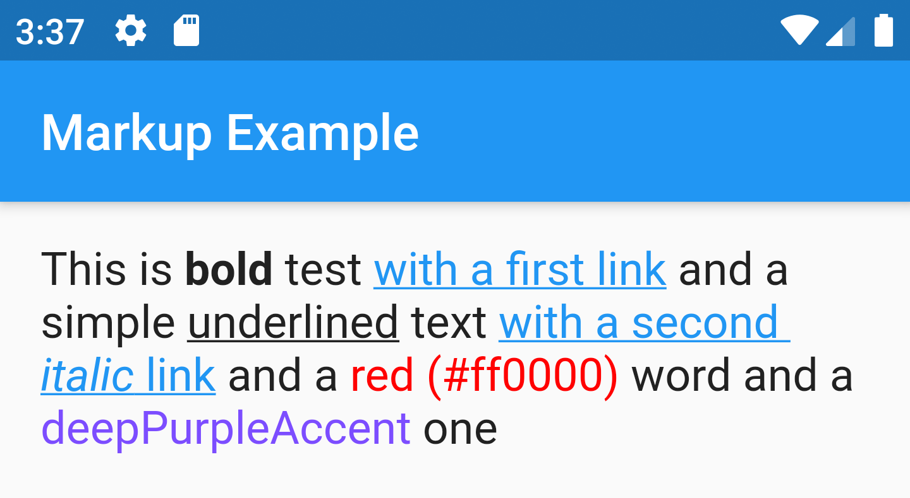

# markup_text


Flutter widget to use Markup to easily create formatted Text.

**Please star the repo to support the project**

### Resources:
- [Pub Package](https://pub.dev/packages/markup_text)
- [GitHub Repository](https://github.com/poqueque/markup_text)

## Contents
c
- [Usage](#usage)

## Usage

`MarkupText` is a wrapper for `RichText` that simplifies the creation of text with mixed styles.

```dart
MarkupText("This is a (b)Markup(/b) example with (c deepPurple)a purple text(/c)")
```


### style

The `style` parameter works as with the `Text` widget. Styles defined will merge with default Style for Text.

```dart
MarkupText(
            "This is (b)bold(/b) test (a http://flutter.dev)with a first link(/a)"
            " and a simple (u)underlined(/u) text (a http://pub.dev)with"
            " a second (i)italic(/i) link(/a) and a (c #ff0000)red (#ff0000)(/c) word"
            " and a (c deepPurpleAccent)deepPurpleAccent(/c) one",
            style: TextStyle(fontSize: 18),
          ),
```



### Markup language

The following tags are recognized by the widget

#### (b)Bold(/b)

```dart
MarkupText("This is a (b)bold(/b) text")
```

#### (i)Italic(/i)

```dart
MarkupText("This is an (i)italic(/i) text")
```

