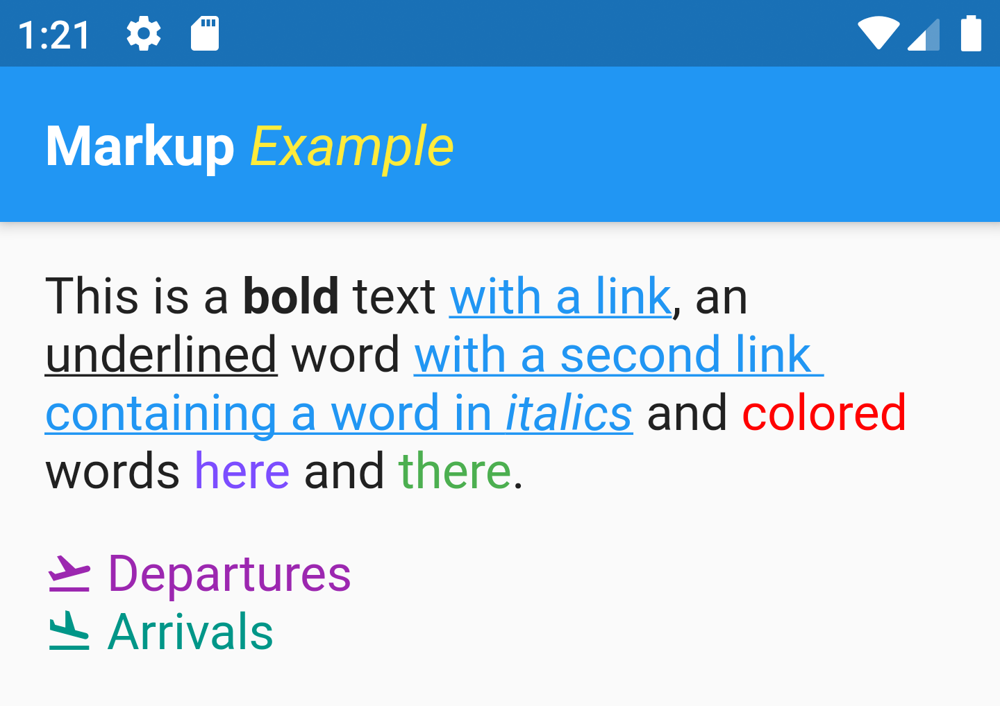

# markup_text


[](https://pub.dev/packages/markup_text)

Flutter widget to use Markup to easily create formatted Text.

**Please star the repo to support the project**

### Resources:
- [Pub Package](https://pub.dev/packages/markup_text)
- [GitHub Repository](https://github.com/poqueque/markup_text)

## Usage

`MarkupText` is a wrapper for `RichText` that simplifies the creation of text with mixed styles.

```dart
MarkupText("This is a (b)Markup(/b) example with (c deepPurple)a purple text(/c)")
```

### style

The `style` parameter works as with the `Text` widget. Styles defined will merge with default Style for Text.

```dart
  MarkupText(
    "This is a (b)bold(/b) text (a http://flutter.dev)with a link(/a),"
    " an (u)underlined(/u) word (a http://pub.dev)with"
    " a second link containing a word in (i)italics(/i)(/a) and (c #ff0000)colored(/c) words"
    " (c deepPurpleAccent)here(/c) and (c green)there(/c).",
    style: TextStyle(fontSize: 18),
  ),

  MarkupText(
    "(c purple)(icon flight_takeoff) Departures(/c)\n"
    "(c teal)(icon flight_land) Arrivals(/c)",
    style: TextStyle(fontSize: 18),
  ),
```



### Markup language

The following tags are recognized by the widget

#### Bold

Use tag (b)..(/b) for bold text

```dart
MarkupText("This is a (b)bold(/b) text")
```

#### Italic

Use tag (i)..(/i) for italic text

```dart
MarkupText("This is an (i)italic(/i) text")
```

#### Underlined

Use tag (u)..(/u) for underlined text

```dart
MarkupText("This is an (u)underlined(/u) text")
```

#### Links

Use tag (a \<url\>)..(/a) to create links

```dart
MarkupText("(a http://example.com)This is a link(/a)")
```
#### Colors

Use tag (c \<color\>)..(/c) to create colored text

```dart
MarkupText("(c #ff0000)Colors from RGB codes(/c)")
```
```dart
MarkupText("(c amber)You can also use named colors(/c)")
```
You can use all the colors included in the [Material `Colors` class from Flutter](https://api.flutter.dev/flutter/material/Colors-class.html#constants).
You can check the full list [below](#Colors list).

#### Icons

Use tag (icon \<icon name\>) to insert an icon. The icon will be colored when affected by a color tag.

```dart
MarkupText("(c red)(icon error) An error has occurred(/c)")
```

You can use all the icons included in the [Material `Icons` class from Flutter](https://api.flutter.dev/flutter/material/Icons-class.html#constants).


## Colors list

\<color\> can be either a RGB color code started with `#` or a named color. Valid names are the ones defined on the Flutter class Colors:

| Color Name | Color |
| ------------- | :-----------: |
| amber |  |
| amberAccent |  |
| black |  |
| black12 |  |
| black26 |  |
| black38 |  |
| black45 |  |
| black54 |  |
| black87 |  |
| blue |  |
| blueAccent |  |
| blueGrey |  |
| brown |  |
| cyan |  |
| cyanAccent |  |
| deepOrange |  |
| deepOrangeAccent |  |
| deepPurple |  |
| deepPurpleAccent |  |
| green |  |
| greenAccent |  |
| grey |  |
| indigo |  |
| indigoAccent |  |
| lightBlue |  |
| lightBlueAccent |  |
| lightGreen |  |
| lightGreenAccent |  |
| lime |  |
| limeAccent |  |
| orange |  |
| orangeAccent |  |
| pink |  |
| pinkAccent |  |
| purple |  |
| purpleAccent |  |
| red |  |
| redAccent |  |
| teal |  |
| tealAccent |  |
| transparent |  |
| white |  |
| white10 |  |
| white12 |  |
| white24 |  |
| white30 |  |
| white38 |  |
| white54 |  |
| white60 |  |
| white70 |  |
| yellow |  |
| yellowAccent |  | 